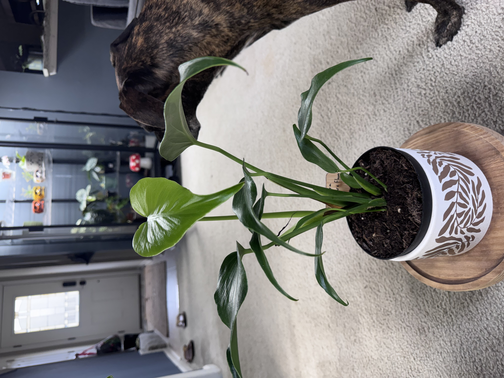
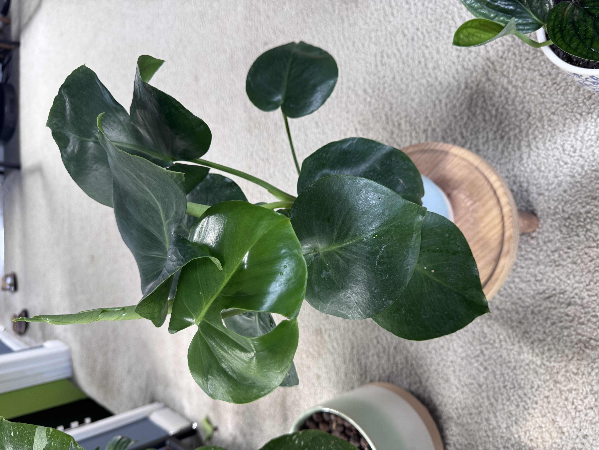
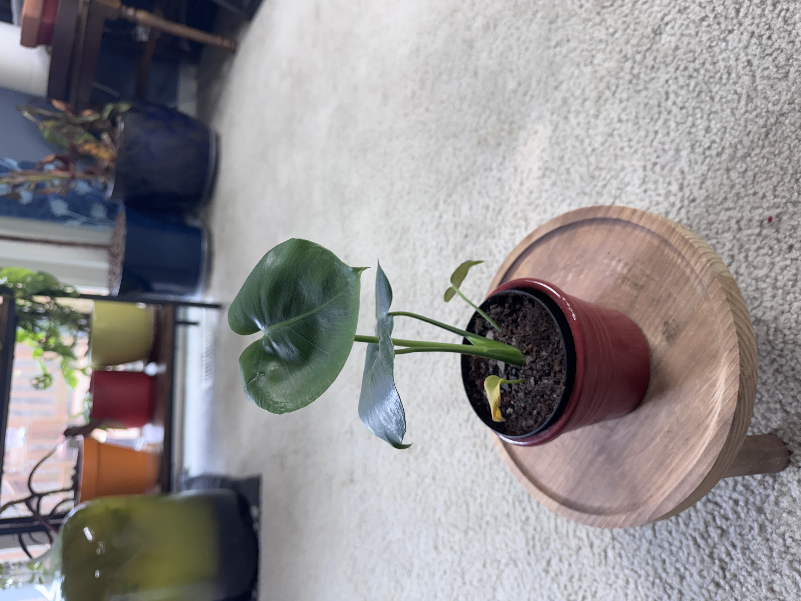
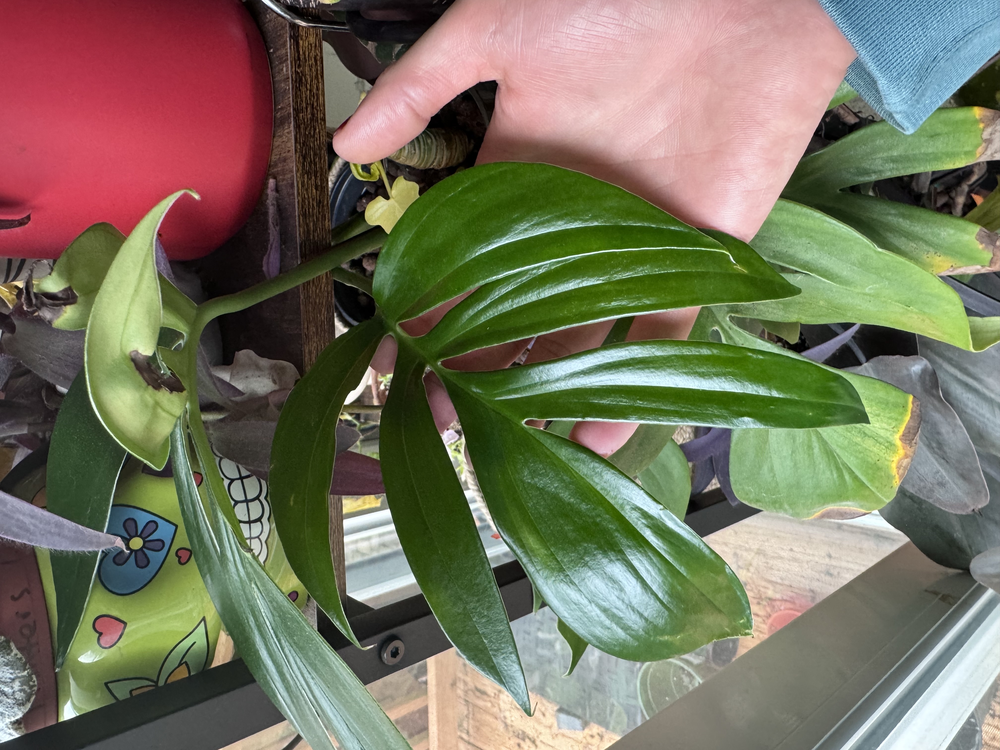
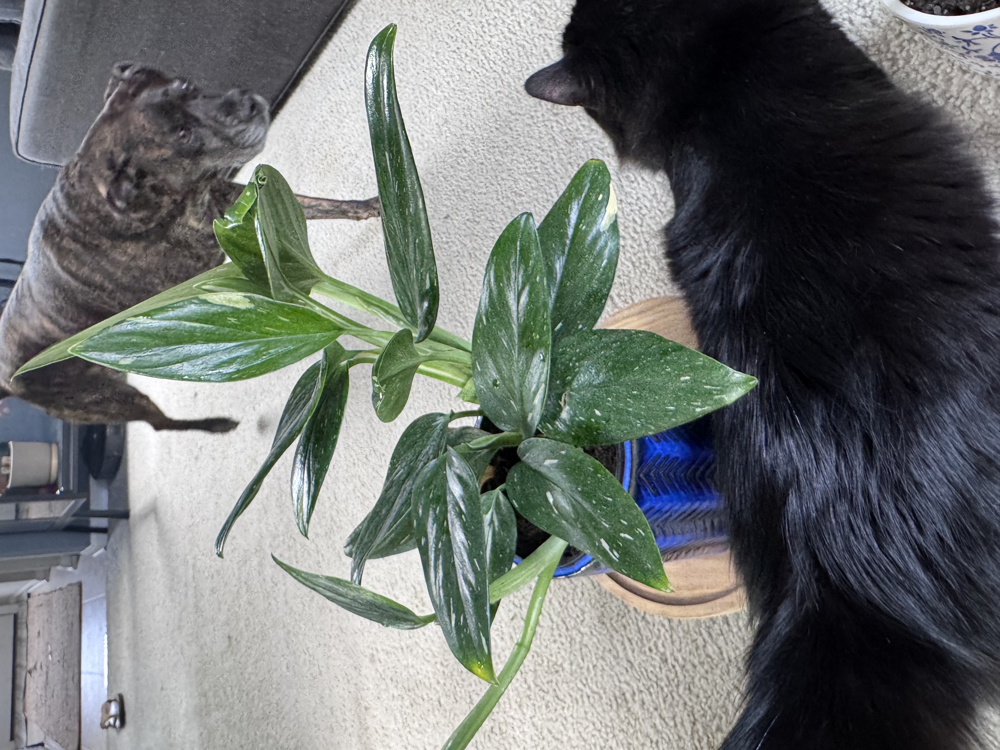
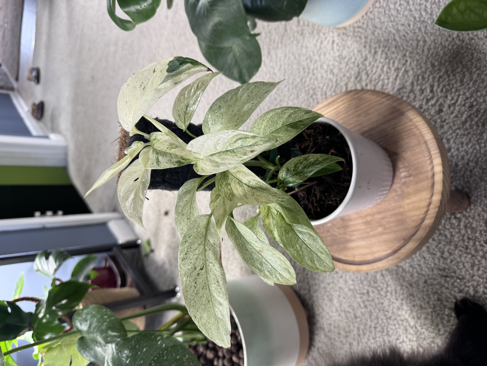

  

    Table of contents
  

  {: .text-delta }
1. TOC
{:toc}

# Burle Marx Flame

# Deliciosa

# Peru

# Standleyana ("Cobra Philodendron")

# Thai Constellation

# Variegated Adansonii Laniata

